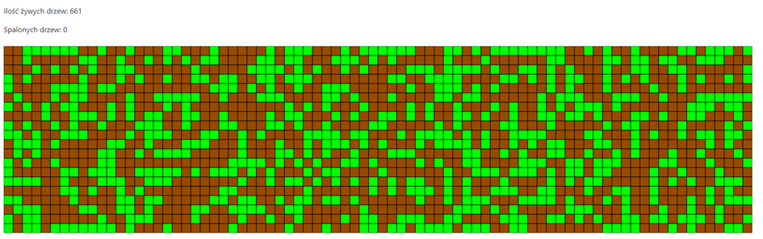

<h1 align="center">Sprawozdanie z Projektu "Symulacja Pożaru Lasu" 
Autor: Dominik Lewczyński, 155099</h1>

## **1. Opis problemu**

Zjawisko pożaru lasu jest jednym z istotnych problemów ekologicznych, które mają poważne konsekwencje dla środowiska naturalnego. Skutki pożarów lasów obejmują utratę różnorodności biologicznej, zniszczenie siedlisk, emisję dużych ilości gazów cieplarnianych, a także wpływ na jakość powietrza. Symulacje komputerowe pozwalają na lepsze zrozumienie dynamiki pożarów lasów, co z kolei może wspomóc w opracowywaniu strategii zarządzania lasem i przeciwdziałania skutkom pożarów.

## **2. Cel Projektu**

Celem projektu jest stworzenie interaktywnej symulacji pożaru lasu, która umożliwia użytkownikowi eksperymentowanie z różnymi parametrami i obserwowanie skutków pożaru w kontrolowanym środowisku. Symulacja ta ma na celu nie tylko dostarczenie wizualnej reprezentacji pożaru lasu, ale również edukację na temat wpływu czynników takich jak prawdopodobieństwo zapłonu czy gęstość drzew na dynamikę rozprzestrzeniania się pożaru.

## **3. Użyte technologie**

Do stworzenia projektu wykorzystano

- HTML do struktury strony
- CSS oraz Bootstrap do ustawienia wyglądu strony
- JavaScript z Biblioteką p5.js do programowania logiki strony

## **4. Metoda wykonania**

Projekt wykorzystuje podejście oparte na automacie komórkowym do symulacji pożaru lasu. Poniżej przedstawiono kluczowe elementy algorytmu oraz sposób implementacji:

**1)	Inicjalizacja Parametrów:**

- a) **`CELL_SIZE`**: Rozmiar pojedynczej komórki (piksele).
- b) **`GRID_WIDTH`** i **`GRID_HEIGHT`**: Szerokość i wysokość siatki komórek.
- c) **`TREE_DENSITY`**: Procentowa gęstość drzew na siatce.
- d) **`FIRE_PROB`**: Prawdopodobieństwo zapłonu drzewa, jeśli ma sąsiada płonącego.

**2)	Inicjalizacja Zmiennych Globalnych:**

- a) **`grid`**: Tablica dwuwymiarowa przechowująca stany komórek (drzewo, ogień, popiół).
- b) **`fireStarted`**: Flaga oznaczająca, czy pożar został zainicjowany.
- c) **`fireSources`**: Tablica przechowująca współrzędne miejsc, w których użytkownik kliknął.
- d) **`isForestBurned`**: Flaga oznaczająca czy cały las został spalony.
- e) **`burnedTreesCount`**: Liczba spalonych drzew.
- f) **`changesApplied`**: Flaga śledząca, czy zmiany zostały zastosowane.

**3) Zatwierdzanie Zmian:**

- a) Funkcja **`applyChanges()`** odpowiada za aktualizację parametrów symulacji na podstawie danych z formularza.
- b) Sprawdzane są warunki czy wartości parametrów są większe od zera. W przypadku, gdy któryś z parametrów wynosi zero, użytkownik otrzymuje alert o niemożliwości uruchomienia symulacji.

**4) Rysowanie Siatki:**

- a) Funkcja **`drawGrid()`** przegląda wszystkie komórki siatki i rysuje prostokąty o odpowiednich kolorach w zależności od stanu komórki.

**5) Zainicjowanie Pożaru:**

- a) W funkcji **`mousePressed()`**, po kliknięciu myszą, sprawdzane są współrzędne i, j komórki. Jeśli komórka zawiera drzewo, staje się źródłem ognia.

**6) Aktualizacja Stanów Komórek:**

- a) W funkcji **`updateGrid()`**, na podstawie reguł automatu komórkowego, aktualizowane są stany komórek, uwzględniając sąsiadów.

**7) Sprawdzenie Stanu Lasu:**

- a) Funkcja **`isEntireForestBurned()`** sprawdza, czy wszystkie drzewa zostały spalone, co kończy symulację.

**8) Rysowanie Statystyk:**

- a) Funkcja **`drawStatistics()`** aktualizuje i wyświetla statystyki, takie jak ilość żywych i spalonych drzew.

**9) Interaktywność:**

- a) Użytkownik może regulować gęstość drzew przy użyciu suwaka.
- b) Prawdopodobieństwo zapłonu jest wyrażone w procentach, a jego zmiana także jest interaktywna.
- c) Szybkość animacji również jest regulowana przy użyciu suwaka.

**10) Alert o Niemożliwości Uruchomienia Symulacji:**

- a) W przypadku próby uruchomienia symulacji z zerowymi wartościami parametrów, użytkownik otrzymuje alert informujący o konieczności ustawienia wartości większych od zera.

**11) Widoczność Planszy:**

- a) Po zastosowaniu zmian, plansza w elemencie **`<main>`** jest wyświetlana.

## **5. Instalacja Dodatkowego Oprogramowania**

Do uruchomienia projektu nie są wymagane dodatkowe instalacje. Projekt wykorzystuje jedynie przeglądarkę internetową do uruchomienia aplikacji. Po pobraniu plików należy otworzyć w przeglądarce internetowej plik index.html. Można także wejść na stronę **https://dlquake.github.io/Forest-Fire-Simulation/** gdzie będzie dostępny projekt bez potrzeby pobierania plików.

## **6. Wizualizacje**

Wizualizacje obejmują animację symulacji, gdzie kolor komórek reprezentuje stan drzewa (zielony), płonącego drzewa (czerwony), obszaru spalonego drzewa (szary) oraz pustej komórki (brązowy). Dodatkowo, dostępne są statystyki na temat ilości żywych drzew i spalonych drzew.

Przykład planszy reprezentującej las

## **7. Wnioski**

Projekt pozwala na wizualizację procesu rozprzestrzeniania się pożaru w lesie, dając użytkownikowi możliwość eksperymentowania z różnymi parametrami. Wnioski z projektu mogą obejmować zrozumienie wpływu parametrów na dynamikę pożaru oraz refleksję nad koniecznością zrównoważonego zarządzania lasem.

## **8. Kierunek Rozwoju**

Projekt można rozwijać, dodając bardziej zaawansowane funkcje, takie jak interakcje między różnymi typami drzew, modele topograficzne czy uwzględnianie bardziej realistycznych warunków atmosferycznych. Możliwości edukacyjne symulacji można poszerzyć o dodatkowe materiały informacyjne na temat ekologii leśnej i strategii przeciwdziałania pożarom.
